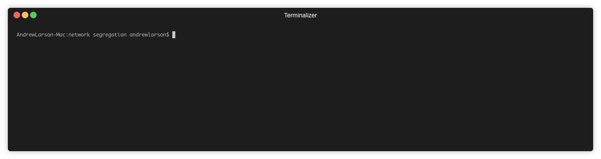

# Network Segregration with Kubernetes and Cilium
This demo uses [minikube](https://kubernetes.io/docs/tasks/tools/install-minikube/) and cilinium based on the guide from the Cilium [site](https://cilium.readthedocs.io/en/latest/gettingstarted/minikube/#gs-minikube
)

*install instructions:*

1. start minikube</br>
`$ minikube start --network-plugin=cni --extra-config=kubelet.network-plugin=cni --memory=5120`
2. Install etcd as a dependency of cilium in minikube by running:</br>
`$ kubectl create -n kube-system -f https://raw.githubusercontent.com/cilium/cilium/HEAD/examples/kubernetes/addons/etcd/standalone-etcd.yaml`</br>
`$ kubectl create -f https://raw.githubusercontent.com/cilium/cilium/HEAD/examples/kubernetes/1.8/cilium.yaml`
3. Check deployment</br>
`$ kubectl get daemonsets -n kube-system`
``` 
NAME         DESIRED   CURRENT   READY   UP-TO-DATE   AVAILABLE   NODE SELECTOR   AGE
cilium       1         1         1       1            1           <none>          57m
kube-proxy   1         1         1       1            1           <none>          58m
```
4. Create the sample applications</br>
`$ kubectl create -f kubernetes/app-a-app-b.yaml`
5. Confirm the containers can access one another</br>
`$ kubectl exec client-a -- curl -s http://service-b/hello -m 1`</br>
`$ kubectl exec client-a -- curl -s http://service-a/hello -m 1`</br>
`$ kubectl exec client-b -- curl -s http://service-b/hello -m 1`</br>
`$ kubectl exec client-b -- curl -s http://service-a/hello -m 1`</br>


6. Apply network policy</br>
`$ kubectl create -f kubernetes/l4-network-policy.yaml`
7. Confirm access is restricted</br>
`$ kubectl exec client-b -- curl -s http://service-b/hello -m 1`</br>
`$ kubectl exec client-b -- curl -s http://service-a/hello -m 1`</br>

